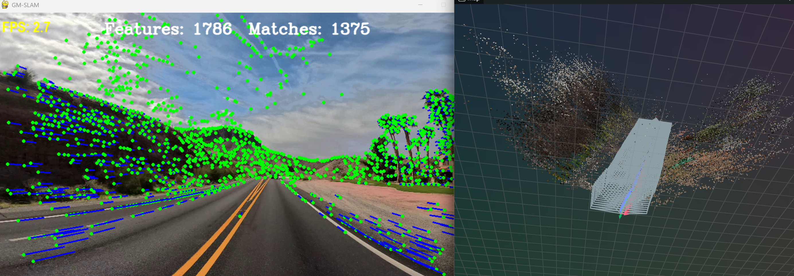
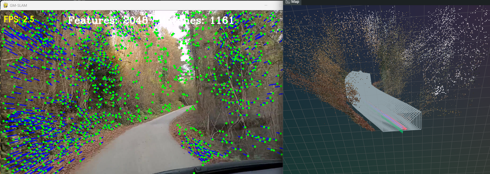
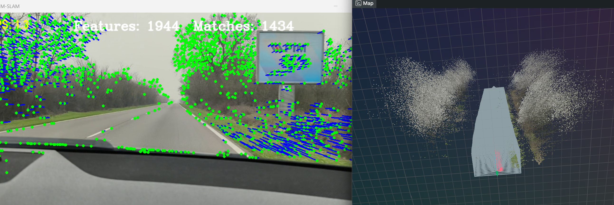
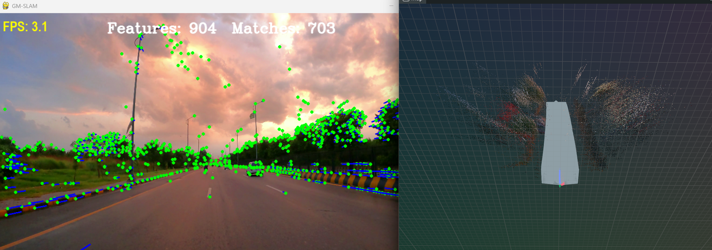
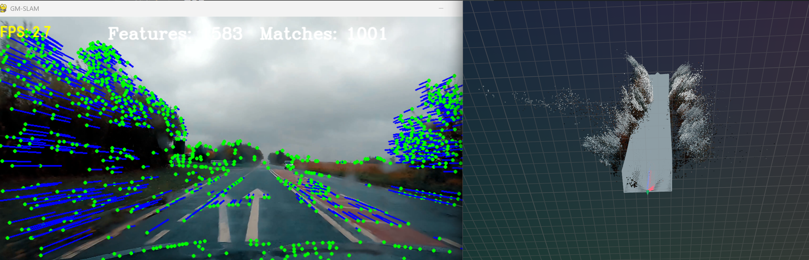
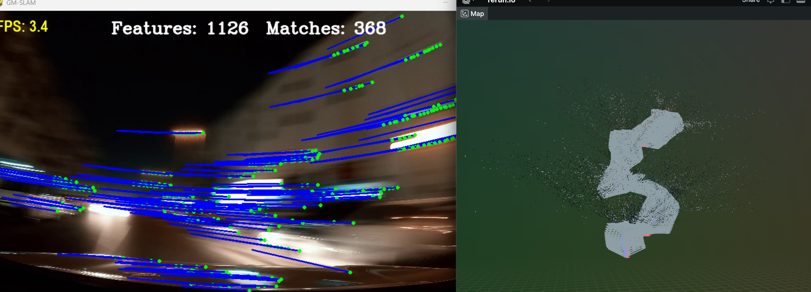
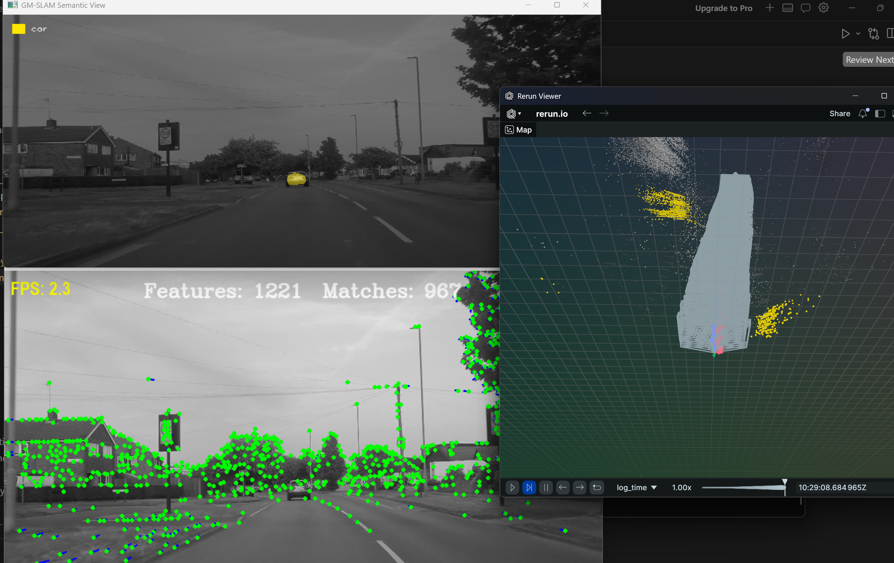
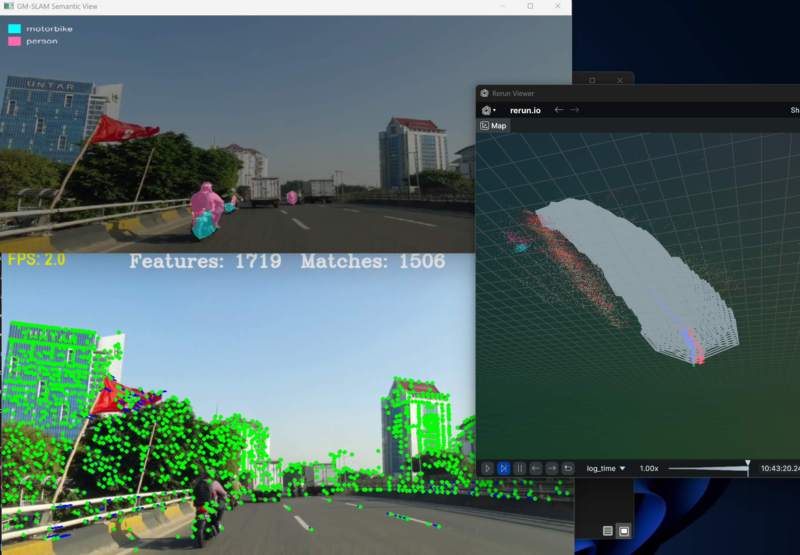

# GM-SLAM

Monocular feature-based Visual SLAM in Python using Deep Leaning algorithms. A single camera stream is processed frame by frame: learned features are detected and matched, camera motion is estimated from two-view geometry, and 3D map points are triangulated and shown in a live 3D viewer.








## Overview

The pipeline runs on video input (file or default path under `videos/`):

1. **Feature extraction** — [ALIKED](https://github.com/cvg/LightGlue) keypoints via LightGlue.
2. **Feature matching** — consecutive frames matched with [LightGlue](https://github.com/cvg/LightGlue).
3. **Outliers filtering** - I used MAGSAC++ instead of the classic RANSAC 
4. **Pose estimation** — essential matrix and pose recovery with OpenCV (`findEssentialMat`, `recoverPose`).
5. **Mapping** — triangulation of inlier matches; scale from median scene depth on the second frame.
6. **Visualization** — 2D match view (Pygame) and 3D map / camera trajectory ([Rerun](https://rerun.io/)).

## Semantic SLAM (small attempt)

This is a lightweight experiment on top of the core SLAM pipeline — not full semantic SLAM, but a first step toward labeling the map with object classes.

When enabled with `--semantic`, each frame is run through **DeepLabV3** (ResNet-50, torchvision, COCO classes). A second Pygame window shows a color overlay for a few dynamic classes: person, bicycle, car, motorbike, and bus.

On the mapping side, semantics are attached only where the SLAM pipeline already creates 3D points: when a new map point is triangulated from matched keypoints, the class at that pixel is sampled from the segmentation mask. Those points are drawn in Rerun as a separate colored layer (`world/semantic_points`), on top of the normal map.




**Limitations (by design for now):**

- Labels come from sparse feature locations, not from the full segmentation mask — so cars and other objects appear as scattered colored points, not solid shapes.
- No instance tracking, dense semantic fusion, or object bounding boxes in 3D.
- Semantic metadata is not saved in the `.npz` map file yet.

It is useful for exploring how class labels could sit on a monocular map, but it should be read as a prototype rather than a finished semantic mapping module.

## Libraries

| Library | Role in this project |
| --- | --- |
| NumPy | Poses, homogeneous coordinates, triangulation math |
| OpenCV | Video I/O, essential matrix, pose recovery, triangulation, calibration |
| PyTorch | GPU/CPU backend for learned features and matching |
| LightGlue | ALIKED extractor and LightGlue matcher between frames |
| Torchvision | DeepLabV3 semantic segmentation (optional `--semantic` mode) |
| Rerun | Live 3D viewer for map points, camera poses, and trajectory |
| Pygame | 2D display window with match visualization and FPS |

## Requirements

- Python 3.10+ recommended
- CUDA-capable GPU optional (CPU fallback supported)
- A video file for input (see [Usage](#usage))

## Installation

```bash
git clone https://github.com/<your-username>/GM-SLAM.git
cd GM-SLAM

pip install -r requirements.txt
```

Now we have to install the deep learning algorithms. First go to the source directory.
```bash
cd src
```

Then run this commands:
```bash
git clone https://github.com/cvg/LightGlue.git
cd LightGlue
python -m pip install -e .

```

Deep learning algorithms uses Pytorch under the hood. After runing the command python -m pip install -e . it install pytorch but in my case it was CPU only version. I had uninstall the installed version using the command:
```bash
pip uninstall torch torchvision torchaudio -y  
```

Then you have to check what version of CUDA your GPU suports using the command:
```bash
nvidia-smi 
```

After you know what version of CUDA your GPU suppors you can install the Pytorch from the official site: https://pytorch.org/get-started/locally/

## Usage
In my case i had to start the Rerun Viewer using the command:
```bash
python -m rerun 
```

Then you start the slam using the command:
```bash
python src/slam.py "../videos/video4.mp4"
```

Optional semantic overlay and 3D class-colored points ([Semantic SLAM (small attempt)](#semantic-slam-small-attempt)):
```bash
python src/slam.py "../videos/video4.mp4" --semantic
```

Loading saved map and map data:
Example: 
```bash
python src/load_map.py "maps/video10_20260607_123159.npz"
```

## Project structure

```
GM-SLAM/
├── src/
│   ├── slam.py              # Main loop
│   ├── process_frame.py     # Per-frame pipeline
│   ├── extractor.py         # ALIKED feature extraction
│   ├── matcher.py           # LightGlue matching + 2D overlay
│   ├── pose_estimation.py   # Essential matrix, pose, triangulation into map
│   ├── triangulate.py       # Two-view triangulation
│   ├── map.py               # Frames, points, Rerun 3D view, logic for saving and loading the map
│   ├── display2d.py         # Pygame 2D viewer
│   ├── frame.py / point.py  # Map entities
│   ├── helpers.py           # CLI and video path resolution
│   ├── optimize.py          # Local Bundle Adjustment optimization
│   ├── semantic_slam/       # Optional semantic segmentation (DeepLabV3)
│   │   ├── frame_segmentation.py
│   │   └── display2d.py
│   └── camera/
│       └── calibrate-camera.py
    --- load_map.py # Script for loading saved map and map data in the Rerun Viewer
├── videos/                  # Input videos (gitignored)
└── requirements.txt
```

## TODOS
- Consider moving the BA optimisation in seperated thread
- More optimization if needed
- Loop Closure detection
- Pose Graph Optimization after loop detection

## License

See [LICENSE](LICENSE).
